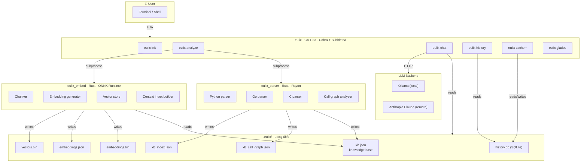

# Architecture: System Overview

> **Purpose:** Shows the three-binary architecture at a glance — who owns what,
> which language each component is written in, and how the pieces fit together from
> the user's perspective. Start here if you're new to the codebase.
>
> **Limitation:** This is a static, conceptual view. It does not show data flow,
> message formats, or the runtime interaction sequences between components.
> See [02-data-pipeline.md](./02-data-pipeline.md) and [03-query-pipeline.md](./03-query-pipeline.md)
> for those details.

---

## Diagram

---

## Component Responsibilities

| Component | Language | Key responsibility |
|-----------|----------|--------------------|
| `eulix` CLI | Go | User interface, orchestration, config, caching, TUI |
| `eulix_parser` | Rust | Static analysis — symbols, call graphs, complexity |
| `eulix_embed` | Rust | Vector generation — ONNX models, binary/JSON output |
| `.eulix/` dir | — | All persistent state lives here (no server required) |
| LLM backend | — | Natural-language generation only; never sees raw source |

---

## Design Decisions & Trade-offs

| Decision | Rationale | Trade-off |
|----------|-----------|-----------|
| Three separate binaries | Independent release, language-appropriate tooling | More complex build; subprocess IPC instead of in-process calls |
| All state in local files | Zero infrastructure — works offline | No multi-user sharing; large codebases produce large JSON files |
| LLM only sees AST/semantic data | Prevents leaking raw source to remote APIs | LLM cannot see implementation logic; answers are structural only |
| Rust for parser + embedder | Performance — 9M LOC/40s parsing; ONNX GPU acceleration | Requires Rust toolchain on top of Go |
