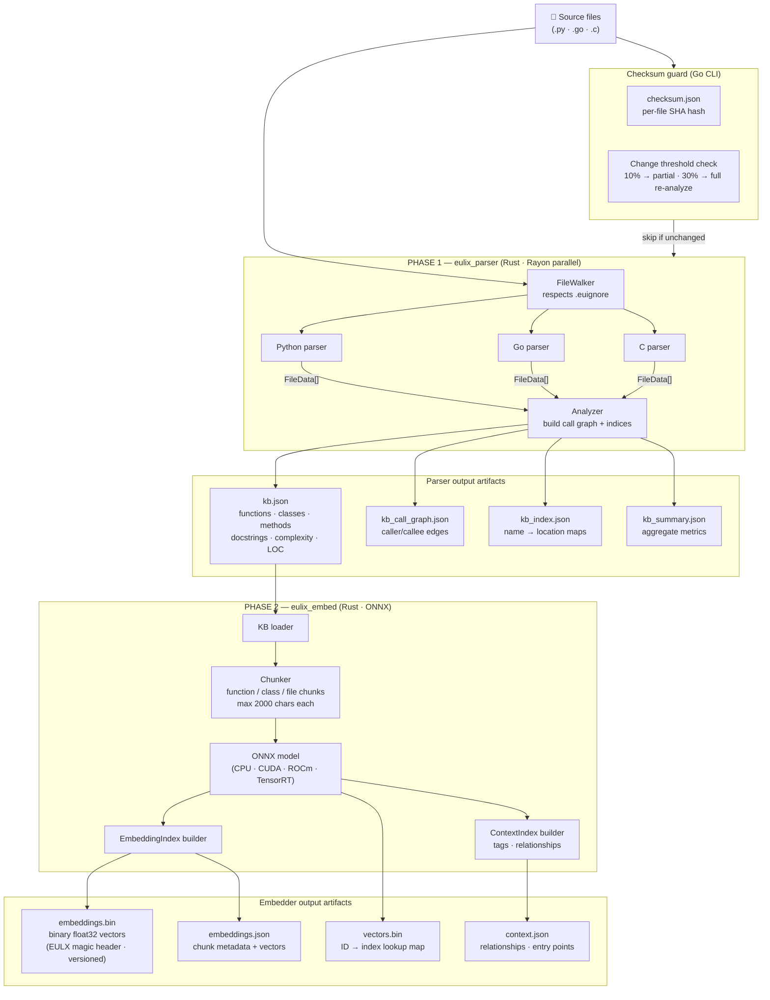

# Architecture: Data Pipeline (analyze)

> **Purpose:** Traces the full journey from raw source files on disk to the
> `.eulix/` artifact store that powers all queries. This diagram covers the
> `eulix analyze` command — the "offline" half of the system.
>
> **Limitation:** Internal implementation details of individual parsers (AST
> node traversal, call-graph algorithm) are not shown. GPU acceleration branching
> inside `eulix_embed` is omitted for clarity. See the Rust source files
> `eulix-parser/src/parser/` and `eulix-embed/src/onnx_backend.rs` for those
> details.

---

## Diagram

---

## Artifact Reference

| File                 | Format              | Size (typical)   | Consumed by                                       |
| -------------------- | ------------------- | ---------------- | ------------------------------------------------- |
| `kb.json`            | JSON                | 1 – 300 MB       | `eulix_embed`, Go context builder                 |
| `kb_call_graph.json` | JSON                | 100 KB – 50 MB   | Go router (dependency/usage queries)              |
| `kb_index.json`      | JSON                | 10 – 5 MB        | Go classifier symbol validation, location queries |
| `kb_summary.json`    | JSON                | < 5 KB           | Informational                                     |
| `embeddings.bin`     | Binary (LE float32) | ~150 KB – 50 MB  | Go context builder (vector search)                |
| `embeddings.json`    | JSON                | ~900 KB – 200 MB | Go context builder (chunk metadata)               |
| `vectors.bin`        | Binary (ID map)     | ~150 KB – 50 MB  | Go context builder (ID → index lookup)            |
| `context.json`       | JSON                | ~200 KB          | Embedder internal; not currently used by Go       |
| `checksum.json`      | JSON                | < 1 MB           | CLI change-detection; cache invalidation key      |

---

## Limitations to be Aware Of

| Limitation                             | Impact                                                         | Possible Mitigation                                  |
| -------------------------------------- | -------------------------------------------------------------- | ---------------------------------------------------- |
| Only Python, Go, and C are parsed      | JS/TS/Rust sources are silently skipped                        | Implement missing parsers (Rust is highest priority) |
| No incremental re-parse                | Any change triggers full re-parse of changed files             | Implement per-file caching using `checksum.json`     |
| Token count = `len(content) / 4`       | Context window can overflow on code-dense chunks               | Use a real tokeniser per model                       |
| `kb.json` loaded entirely into RAM     | Very large codebases may cause OOM                             | Stream KB or use a database backend                  |
| Binary format is versioned (`EULX v2`) | Older `.eulix/` dirs silently fail; `aspirine` command can fix | Surface version mismatch with a clearer user message |
