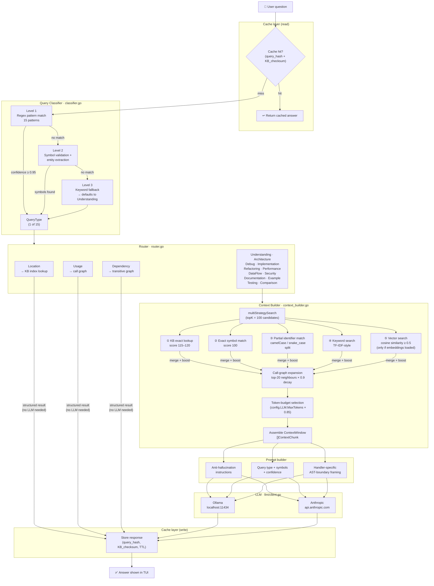
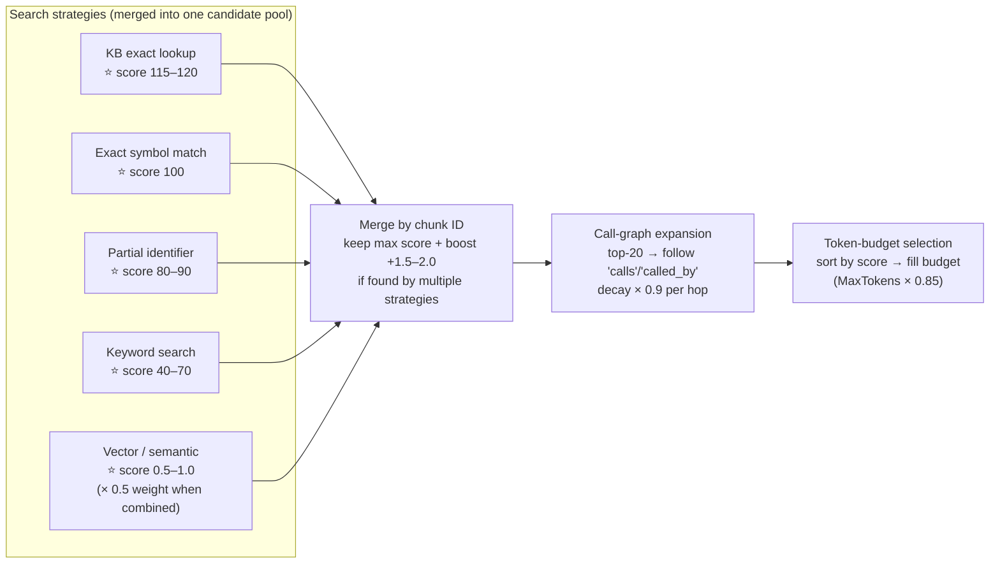

# Architecture: Query Pipeline (chat)

> **Purpose:** Describes the full runtime path from a user's natural-language
> question to the final LLM response. This is the "online" half of the system —
> everything that happens during `eulix chat`. This is the most complex subsystem
> in the codebase.
>
> **Limitation:** Token-budget arithmetic, score normalisation details, and the
> binary embedding file parsing are not expanded here. The diagram focuses on the
> component-level flow, not the mathematical scoring logic inside each step.

---

## End-to-End Query Flow

---

## Query Type Routing Table

| Query Type | LLM needed | Primary data source | Example question |
|-----------|-----------|-------------------|-----------------|
| Location | ❌ | `kb_index.json` → `FunctionsByName` | "where is `parseFile` defined?" |
| Usage | ❌ | `kb_call_graph.json` | "who calls `buildContext`?" |
| Dependency | ❌ | Call graph (transitive, 2 levels) | "what does `Router` depend on?" |
| Understanding | ✅ | Semantic + call graph context | "how does authentication work?" |
| Implementation | ✅ | Symbol locations + semantic context | "add a new cache backend" |
| Architecture | ✅ | Call graph + semantic context | "describe the overall structure" |
| Debug | ✅ | Semantic context | "why does glados fail on large repos?" |
| Comparison | ✅ | Semantic context (requires ≥2 symbols) | "difference between redis and sql cache" |
| Refactoring | ✅ | Semantic + call graph context | "how can I simplify the router?" |
| Performance | ✅ | Semantic + call graph context | "what's the slow part of the embed pipeline?" |
| DataFlow | ✅ | Call graph + type flow | "how does a query string become a vector?" |
| Security | ✅ | Semantic context | "are there input validation issues?" |
| Documentation | ✅ | Semantic context | "what does `ContextWindowCreator` do?" |
| Example | ✅ | Semantic context | "show me how to use `CacheController`" |
| Testing | ✅ | Semantic context | "how should I test the classifier?" |

---

## Retrieval Strategy Scoring

---

## Known Limitations

| Limitation | Impact | Status |
|-----------|--------|--------|
| KB exact lookup results are discarded by a `make(map)` reset on line ~700 of `context_builder.go` | Highest-quality signal (score 120) never influences context selection | 🐛 Bug — to be fixed |
| Vector search is skipped if `embeddings.bin` is missing or version-mismatched | Falls back to keyword-only retrieval silently | Acceptable fallback but not surfaced to user |
| `eulix_embed` binary path hardcoded as `../eulix_embed` relative to `.eulix/` | Breaks when binary is installed to `$PATH` | 🐛 Bug — to be fixed |
| Token count approximated as `len(bytes) / 4` | Can overflow context window on code-heavy chunks | Should use per-model tokeniser |
| Classification is single-winner (first regex match wins) | Overlapping queries may route incorrectly | Classifier accuracy degrades on ambiguous queries |
| No streaming LLM responses | TUI shows spinner until full response arrives | Suboptimal UX for long answers |
