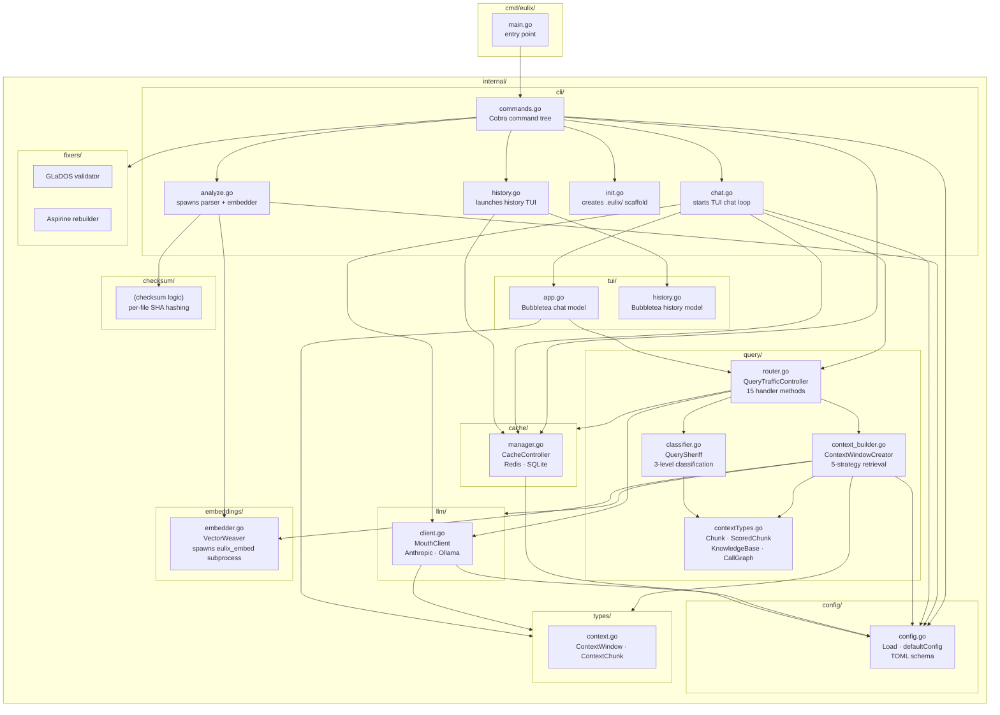
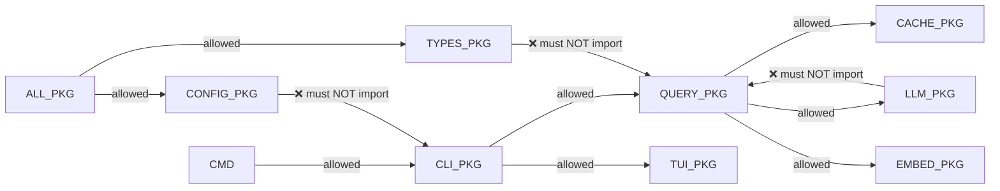

# Architecture: Go Module Structure

> **Purpose:** Shows the internal Go package dependency graph for the `eulix` CLI.
> Useful when adding a new package or refactoring an existing one — it makes
> dependency cycles and single-responsibility violations immediately visible.
>
> **Limitation:** Covers the Go CLI only. The two Rust crates (`eulix-parser`,
> `eulix-embed`) are separate workspaces and are **not** shown here. Indirect
> third-party dependencies (Cobra, Bubbletea, etc.) are omitted; only first-party
> packages are shown.

---

## Package Dependency Graph



---

## Package Responsibilities

| Package | Files | Single responsibility |
|---------|-------|----------------------|
| `cmd/eulix` | `main.go` | Binary entry point; delegates to `cli` |
| `internal/cli` | 5 files | Cobra command wiring; user-facing orchestration |
| `internal/query` | 4 files | Query classification, context retrieval, LLM routing |
| `internal/llm` | 1 file | HTTP client for Anthropic and Ollama |
| `internal/cache` | 1 file | SQLite + Redis dual-backend response cache |
| `internal/config` | 1 file | TOML config loading with sane defaults |
| `internal/embeddings` | 1 file | Subprocess wrapper around `eulix_embed` binary |
| `internal/types` | 1 file | Shared `ContextWindow` / `ContextChunk` types |
| `internal/tui` | 2 files | Bubbletea models for chat and history views |
| `internal/checksum` | — | File-level SHA hashing for change detection |
| `internal/fixers` | — | `glados` validation + `aspirine` repair utilities |

---

## Key Interfaces (Implicit — Not Yet Formalised)

The following types act as implicit interfaces but are currently concrete structs.
Extracting these to Go interfaces would allow unit testing without real files/network:

```go
// Proposed: llm/provider.go
type Provider interface {
    Query(ctx *types.ContextWindow, prompt string) (string, error)
}

// Proposed: cache/store.go
type Store interface {
    Get(query, checksum string) (string, bool, error)
    Set(query, response, checksum string) error
    Close() error
}

// Proposed: embeddings/embedder.go
type QueryEmbedder interface {
    EmbedQueryBinary(query string) ([]float32, error)
}
```

---

## Dependency Direction Rules



> The `types` and `config` packages are leaf nodes — they must not import any
> other internal package. Violating this creates import cycles.

---

## Limitations

| Limitation | Impact |
|-----------|--------|
| All packages are flat — no sub-packages within `query/` | `context_builder.go` is 1 300 lines; retrieval strategies should be split into sub-packages |
| `cli/commands.go` contains helper functions (`truncateString`, `wrapText`) | These belong in an `internal/util` package |
| No Go interfaces — all deps are concrete structs | Cannot mock LLM/cache for unit tests without real infrastructure |
| `internal/fixers` is exposed as public CLI commands | Repair utilities (`glados`, `aspirine`) should be hidden behind a `dev` subcommand |
