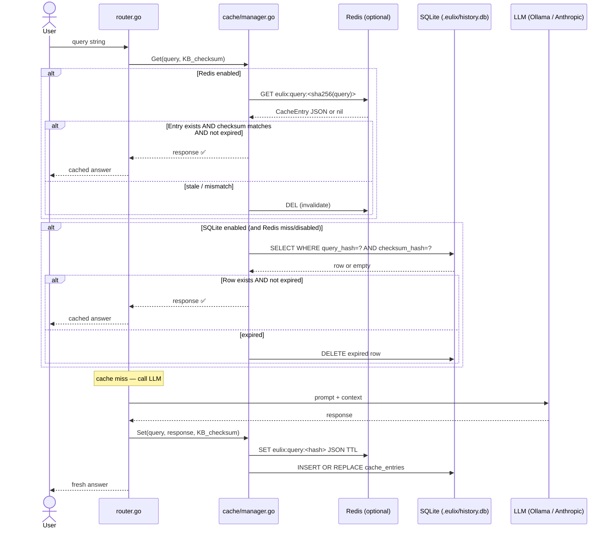
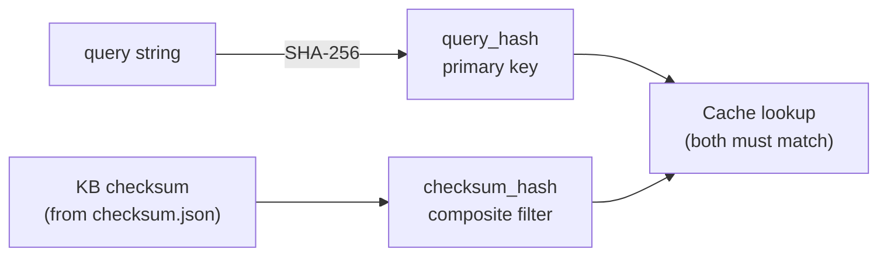

# Architecture: Cache System

> **Purpose:** Documents the dual-backend cache (SQLite + optional Redis) that
> stores LLM responses and serves as the query history. The cache is fundamental
> to performance — identical questions on an unchanged codebase are answered
> instantly without an LLM call.
>
> **Limitation:** Redis invalidation on checksum change is lazy (entries are
> checked at `GET` time, not proactively deleted). The TTL logic uses a single
> global value; per-query-type TTLs are not supported.

---

## Cache Read/Write Flow



---

## Cache Key Design



> **Why two keys?** The query hash alone would return stale answers after the
> codebase changes. Including the KB checksum ensures that any file modification
> that changes the checksum automatically causes a cache miss, forcing a fresh
> LLM call against the new knowledge base.

---

## Storage Schema

### SQLite (`history.db`)

```sql
CREATE TABLE cache_entries (
    query_hash    TEXT PRIMARY KEY,   -- SHA-256 of query string
    query         TEXT NOT NULL,      -- original query (for history display)
    response      TEXT NOT NULL,      -- raw LLM text response
    checksum_hash TEXT NOT NULL,      -- KB checksum at time of caching
    created_at    DATETIME NOT NULL,
    expires_at    DATETIME NOT NULL
);

CREATE INDEX idx_checksum_hash ON cache_entries(checksum_hash);
CREATE INDEX idx_expires_at    ON cache_entries(expires_at);
CREATE INDEX idx_created_at    ON cache_entries(created_at);   -- for history ordering
```

### Redis

```
Key:   eulix:query:<sha256(query)>
Value: JSON-serialised CacheEntry
TTL:   config.Cache.Redis.TTLHours (default 6h)
```

---

## Configuration Reference

```toml
# eulix.toml

[cache.sql]
enabled = true
driver  = "sqlite"
dsn     = ".eulix/history.db"   # relative to project root

[cache.redis]
enabled   = false
url       = "redis://localhost:6379"
ttl_hours = 6
```

---

## Cache Operations (CLI)

| Command | Description |
|---------|-------------|
| `eulix history` | Browse cached queries interactively (TUI) |
| `eulix cache list` | List all entries with timestamps |
| `eulix cache list --verbose` | Include query text and response previews |
| `eulix cache stats` | Show entry counts and Redis connection status |
| `eulix cache clean` | Delete all expired entries |
| `eulix cache clear` | Delete ALL entries (with confirmation prompt) |
| `eulix cache delete <hash>` | Delete one specific entry by query hash |

---

## Limitations

| Limitation | Impact | Possible Fix |
|-----------|--------|--------------|
| Redis invalidation is lazy (at GET time) | Stale entries accumulate in Redis until accessed | Run `InvalidateByChecksum` on `eulix analyze` completion |
| Single global TTL | Location/usage queries (deterministic) share the same TTL as LLM answers (non-deterministic) | Per-query-type TTL in config |
| `ListAll` from Redis uses `KEYS eulix:query:*` | `KEYS` blocks Redis on large datasets | Use `SCAN` cursor-based iteration |
| Cache errors during `Set` are silently dropped | If SQLite write fails, the user gets no warning | Log with `log/slog` at WARN level |
| No cache size limit / eviction policy for SQLite | `history.db` grows unboundedly | Add a `max_entries` config and LRU eviction |
| `history.db` is hardcoded as the cache + history store | Cannot separate query history from response cache | Separate into `cache.db` and `history.db` |
