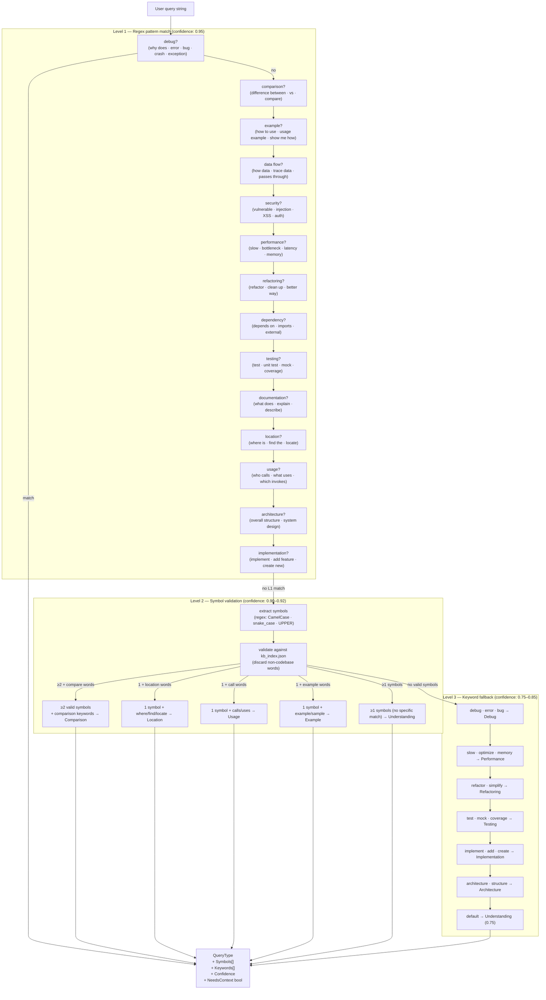
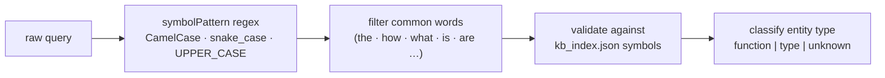

# Architecture: Query Classifier

> **Purpose:** Details the three-level query classification system
> (`internal/query/classifier.go`) that decides which of the 15 query handlers
> to invoke. Understanding this is essential for adding new query types or
> debugging mis-routed queries.
>
> **Limitation:** This diagram represents the *current* cascade logic — a
> chain of early-return `if` statements. It does **not** represent an ideal
> design; the ordering dependency and early-exit behaviour are known limitations
> (documented below).

---

## Classification Decision Tree



---

## Symbol Extraction Pipeline



### Symbol pattern used
```
\b[A-Z][a-z]+(?:[A-Z][a-z]+)*\b   ← CamelCase  (QueryTrafficController)
\b[a-z_][a-z0-9_]*\b              ← snake_case  (context_builder)
\b[A-Z_][A-Z0-9_]+\b              ← UPPER_CASE  (MAX_TOKENS)
```

---

## Query Type Reference

| Type | `NeedsContext` | LLM called | Primary data |
|------|---------------|-----------|-------------|
| Location | `false` | ❌ | `kb_index.FunctionsByName` / `TypesByName` |
| Usage | `false` | ❌ | `kb_call_graph.Functions` |
| Dependency | `false` | ❌ | Call graph (transitive, depth 2) |
| Understanding | `true` | ✅ | Semantic + call graph |
| Implementation | `true` | ✅ | Symbol locations + semantic |
| Architecture | `true` | ✅ | Call graph + semantic |
| Debug | `true` | ✅ | Semantic |
| Comparison | `true` | ✅ | Semantic (min 2 symbols) |
| Refactoring | `true` | ✅ | Semantic + call graph |
| Performance | `true` | ✅ | Semantic + call graph |
| DataFlow | `true` | ✅ | Call graph + type flow |
| Security | `true` | ✅ | Semantic |
| Documentation | `true` | ✅ | Semantic |
| Example | `true` | ✅ | Semantic |
| Testing | `true` | ✅ | Semantic |

---

## Known Classification Bugs & Limitations

| Issue | Example | Result | Root cause |
|-------|---------|--------|-----------|
| Ordering priority overrides intent | `"what does the optimize function do?"` | Routed to **Refactoring** | `refactoringPattern` matches "optimize" before `documentationPattern` matches "what does" |
| Generic words are extracted as symbols | `"how does the Router work?"` | "Router" extracted as symbol even if not in KB | `validateSymbols` falls back to all symbols when `validSymbols` is empty |
| Comparison requires exactly 2+ symbols at L2 | `"compare redis and sql caching strategy"` | If "redis"/"sql" aren't in KB, falls through to L3 | `validateSymbols` discards non-KB words |
| L1 has no score accumulation | `"add test for the performance handler"` | Routed to **Debug** (first regex hit) | Early return on first match; no scoring across all patterns |
| `"not working"` is a debug trigger | `"which functions are not working correctly with mocks?"` | Routed to **Debug** instead of **Testing** | `debugPattern` is checked before `testingPattern` |

### Recommended Fix

Replace the cascade of `if/return` statements with a scorer that evaluates all
patterns and picks the highest confidence:

```go
type PatternScore struct {
    Type       QueryType
    Confidence float64
    Reasoning  string
}

func (c *Classifier) level1PatternMatch(query, queryLower string) *Classification {
    var best PatternScore

    scores := []PatternScore{
        {QueryTypeDebug,    c.score(c.debugPattern, queryLower, 0.95), "debug pattern"},
        {QueryTypeTesting,  c.score(c.testingPattern, queryLower, 0.95), "testing pattern"},
        // ... all 14 patterns
    }

    for _, s := range scores {
        if s.Confidence > best.Confidence {
            best = s
        }
    }

    if best.Confidence >= 0.95 {
        return &Classification{Type: best.Type, Confidence: best.Confidence, ...}
    }
    return nil
}
```

---

## Adding a New Query Type

1. Add a constant to the `QueryType` iota block in `classifier.go`
2. Add its string representation to the `String()` array
3. Add a compiled `*regexp.Regexp` field to `Classifier`
4. Initialise the pattern in `QuerySheriff()`
5. Add a check in `level1PatternMatch` (or `level3KeywordAnalysis`)
6. Add a handler method `(r *Router) handleNewType(...)` in `router.go`
7. Add a `case QueryTypeNewType:` branch in `Router.Query()`
8. Update the routing table in this document
