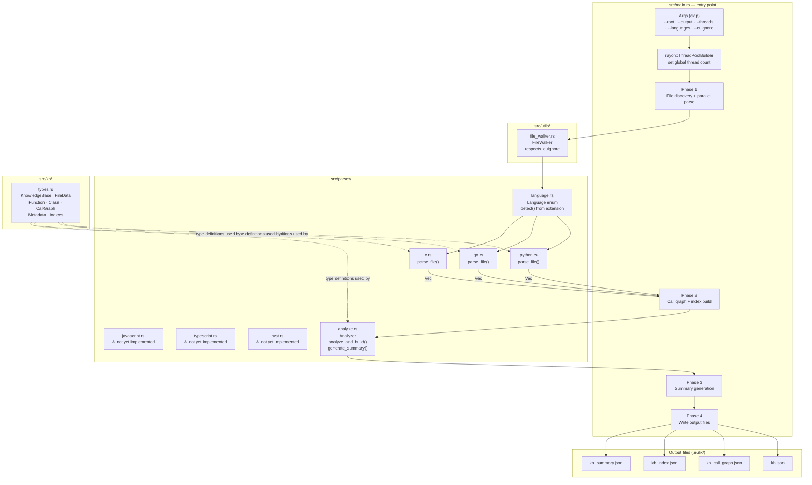
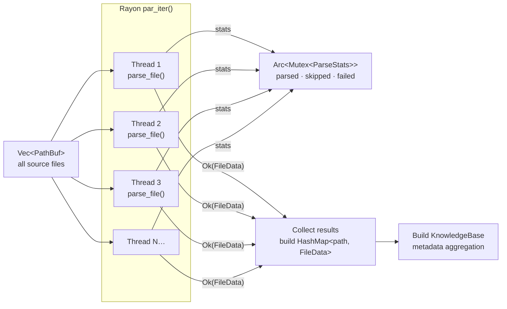
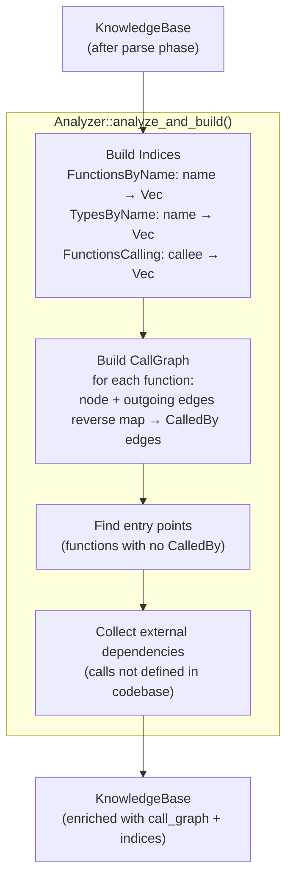

# Architecture: Parser Internals (`eulix_parser`)

> **Purpose:** Describes the internal structure of `eulix_parser` — the Rust
> binary responsible for turning source files into a structured knowledge base.
> Use this when adding language support, debugging parse failures, or understanding
> what data shapes the Go CLI actually receives.
>
> **Limitation:** Individual parser implementations (Python, Go, C) are not
> expanded at the per-node level. The call-graph construction algorithm inside
> `Analyzer` is shown at the phase level only. AST node type details live in
> `eulix-parser/src/parser/<lang>.rs`.

---

## Component Map



---

## Parallel Parsing Pipeline



---

## `FileData` Schema (per source file)

```
FileData {
    language    : String           // "Python" | "Go" | "C"
    loc         : usize            // lines of code
    functions   : Vec<Function>
    classes     : Vec<Class>
}

Function {
    name        : String
    signature   : String
    line_start  : usize
    line_end    : usize
    docstring   : Option<String>
    calls       : Vec<CallRef>     // { callee, line, defined_in }
    complexity  : Option<usize>    // cyclomatic
    is_exported : bool
}

Class {
    name        : String
    line_start  : usize
    line_end    : usize
    docstring   : Option<String>
    methods     : Vec<Function>
}
```

---

## Call-Graph Construction (`Analyzer`)



---

## Language Support Status

| Language   | Extension | Parse | Call Graph | Complexity | Status                    |
| ---------- | --------- | ----- | ---------- | ---------- | ------------------------- |
| Python     | `.py`     | ✅    | ✅         | ✅         | Implemented               |
| Go         | `.go`     | ✅    | ✅         | ✅         | Implemented               |
| C          | `.c` `.h` | ✅    | ✅         | ✅         | Implemented               |
| Rust       | `.rs`     | ✅    | ✅         | ✅         | Implemented               |
| TypeScript | `.ts`     | ✅    | ✅         | ✅         | Implemented(need changes) |
| JavaScript | `.js`     | ❌    | ❌         | ❌         | Returns error             |

> **Note:** Even though JS/TS/Rust are listed in `collect_source_files`, any
> file of those types causes `parse_file()` to return `Err(...)`, which is
> silently counted as a parse failure. The file is skipped without user warning
> unless `--verbose` is passed.

---

## Performance Characteristics

| Metric                 | Value                        | Conditions                       |
| ---------------------- | ---------------------------- | -------------------------------- |
| Throughput             | ~9M LOC / 40s                | Single thread, mixed Python/Go/C |
| Parallelism            | Linear with `-t`             | Rayon work-stealing thread pool  |
| Memory                 | O(total functions + classes) | Full KB held in RAM              |
| Large codebase warning | > 10 000 files               | Printed only in `--verbose` mode |

---

## Limitations

| Limitation                                                     | Impact                                      | Notes                                             |
| -------------------------------------------------------------- | ------------------------------------------- | ------------------------------------------------- |
| JS/TS parsers not implemented/isn't stable                     | Those files fail                            | Highest priority: TS (dogfooding)                 |
| Call graph cross-file resolution depends on name matching      | Overloaded function names cause false edges | Qualify names with file path                      |
| Complexity is per-function cyclomatic; no module-level metrics | Cannot detect "hot" modules                 | Add file-level aggregation                        |
| `--no-analyze` skips call graph entirely                       | Dependency/usage queries return no results  | Warn user in `eulix chat` if call graph is absent |
